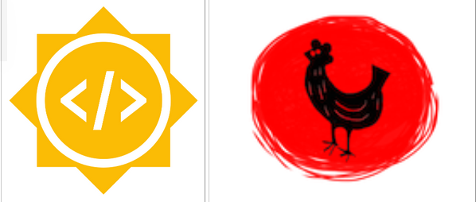

## Pose-analysis-of-art

- [Project Description](#project-description)
 - [Goals](#goals)
 - [Tools and Libraries](#tools/libraries)

 - [About Me](#about-me)
 - [Reference](#reference)

### Project Description

This is my [Google Summer of Code 2019](https://summerofcode.withgoogle.com/projects/#4647330802827264) Project with [Red Hen Lab](http://www.redhenlab.org/).

The goal of this project is to extract and analyze the Body   ​ Gesture and   ​ Pose of the people,   artwork, and sculptures of the medieval period. Interpreted the scenes depicted in the paintings.  For doing so we will be building a annotator tool,which can correct and save the manually  corrected json file.
Project Mentors: [Peter Bell](https://uni-erlangen.academia.edu/PeterBell), [Leonardo Impett](http://www.biblhertz.it/en/institute/staff/staffdatabase/staff-details/ma-leonardo-impett/).

### Goals
- [x] Gesture annotator app
  - [x] Generate the keypoints from openpose in json format
  - [x] Design a Gesture annotator tool
  - [x] make a functionality to be able to trace the emulator on the image
  - [x] add functionality to save new updated keypoints
  - [x] host it online to make the tool usable
  - [x] Build a Rest API to access generated keypoints from remote server
  - [x] Build a NOSQL sever database for storing data
- [x] Deploying it on singularity container

### Tools/Libraries
1. [Dlib](#dlib)
2. [Tensorflow](#tensorflow)
3. [Keras](#keras)
4. [Openpose](#openpose)
5. [Scikit-Learn](#Scikit-Learn)
6. [OpenCV](#OpenCV)
7. [Git](#Git)
8. [Pandas](#Pandas)
9. [Singularity-Container](#Singularity-Container)

### About Me

- **Name**: Ayush Raj
- **Email**: ayushraj.bit17@gmail.com
- **Github**: https://github.com/llucifer97
- **Website**: https://llucifer97.github.io/
- **Resume**: [https://www.linkedin.com/in/ayush-raj97/](https://www.linkedin.com/in/ayush-raj97/)
- **Report**:https://medium.com/@ayushraj.bit17/final-report-redhenlab-gsoc-project-a2f3d54acdb1

This Readme will be updated weekly so stay tuned!

